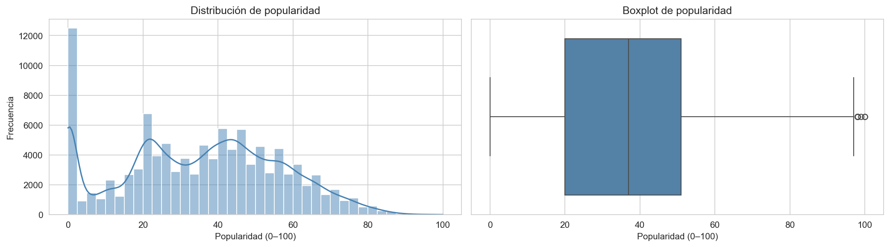
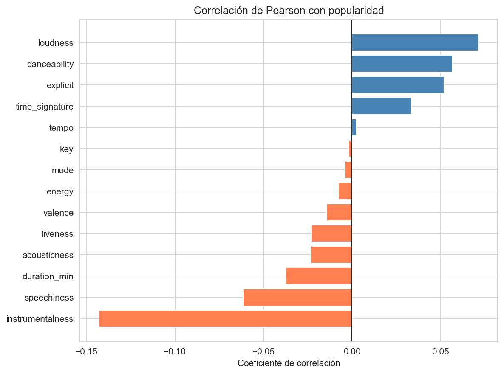
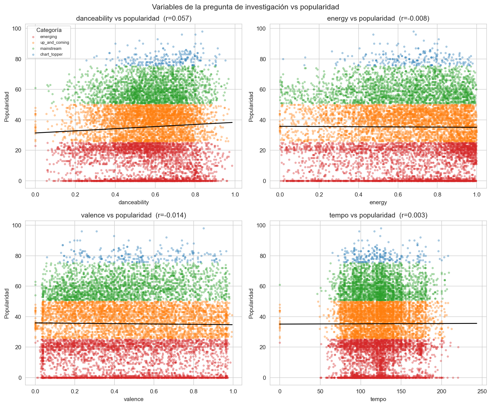
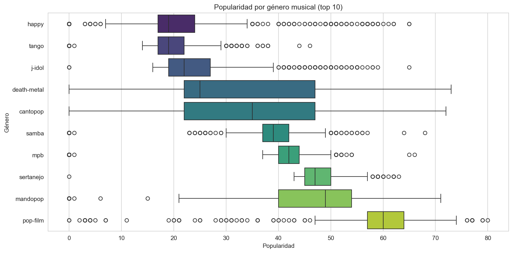
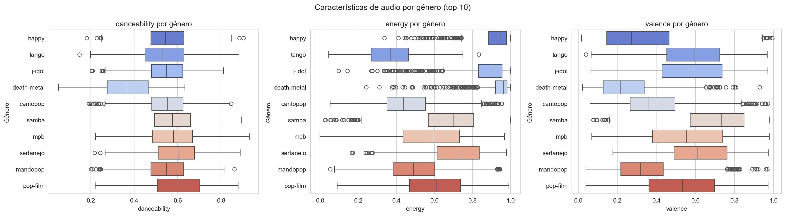
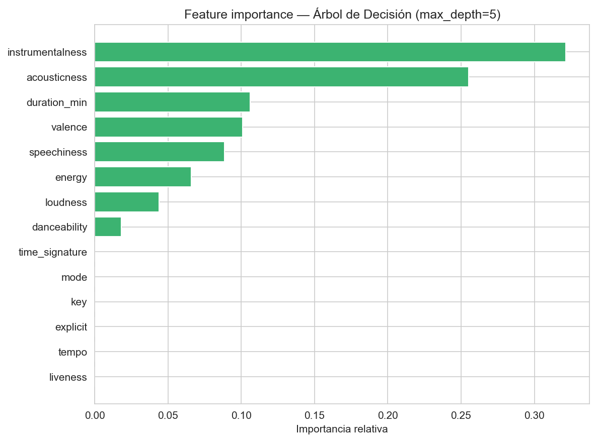
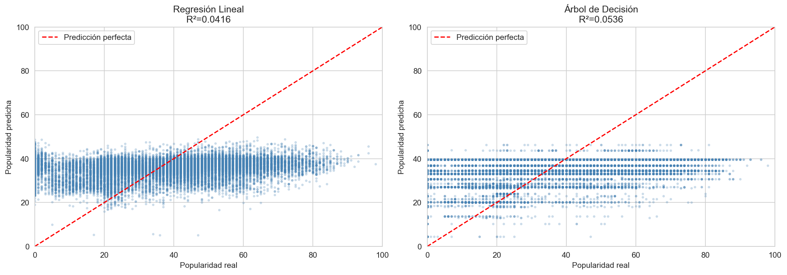

# Análisis completo — Anatomía de una canción popular

**Universidad de Playa Ancha · Ingeniería en Informática · Primer Semestre 2026**  
**Asignatura:** Ciencia de Datos con Python (Optativo II) — Prof. Diego Saavedra Lizana  
**Integrantes:** Martín Maturana · Vicente Tapia · Juan Pablo Poblete · Moisés Espinoza · Benjamín Burgos

---

## Pregunta de investigación

> ¿Qué características de audio (danceability, energy, valence, tempo) predicen mejor la popularidad de una canción en Spotify, y varía este patrón según el género musical?

---

## Dataset

El dataset corresponde a [Spotify Tracks Dataset](https://www.kaggle.com/datasets/maharshipandya/-spotify-tracks-dataset) con ~114.000 canciones y 20 columnas originales. Cada fila representa una canción única en el catálogo de Spotify con sus características de audio calculadas por la API de Spotify y su índice de popularidad (0–100), que refleja el volumen de reproducciones recientes.

**Limpieza aplicada:** se eliminaron las columnas `track_id` (hash interno sin valor analítico) y `album_name` (irrelevante para la pregunta). Se conservó `track_name` como identificador legible y `track_genre` como variable clave del análisis. Se eliminó 1 fila con nulos. No se encontraron duplicados. Se creó `duration_min` (duración en minutos) y `popularity_cat` (categorización en cuatro niveles: *emerging*, *up_and_coming*, *mainstream*, *chart_topper*).

---

## 1. Distribución de popularidad

La distribución de `popularity` presenta un **pico pronunciado cerca de 0**, lo que indica que la mayoría de canciones del catálogo tienen muy pocas reproducciones recientes. Esto responde en parte a la naturaleza del índice de Spotify: solo refleja actividad reciente, por lo que canciones antiguas o de nicho tienden a tener valores bajos independientemente de su calidad musical.

La distribución es **asimétrica positiva** (skewness > 0): pocas canciones alcanzan valores altos. Esta característica tiene implicancias directas para el modelo predictivo, ya que los modelos lineales asumen distribuciones más simétricas en la variable objetivo.

---

## 2. Predictores de audio

### 2.1 Correlación de Pearson con popularidad

Las variables con mayor correlación con `popularity` son:

| Variable | Correlación | Dirección | Interpretación |
|---|---|---|---|
| `instrumentalness` | negativa | ↓ | Las canciones sin voz tienen menor popularidad en plataformas de streaming masivo |
| `acousticness` | negativa | ↓ | Las canciones acústicas tienden a ser menos populares en el catálogo general |
| `loudness` | positiva | ↑ | Canciones más fuertes predominan en géneros populares actuales |
| `explicit` | positiva | ↑ | Asociado a géneros dominantes como rap/trap que lideran el streaming |

Las **4 variables de la pregunta de investigación** (`danceability`, `energy`, `valence`, `tempo`) muestran correlaciones moderadas o débiles con la popularidad global. Esto no significa que sean irrelevantes, sino que su efecto **varía por género** — algo que se analiza en la sección 3.

Todos los coeficientes son bajos (|r| < 0.3), lo que indica que **ninguna variable de audio por sí sola es un predictor fuerte** de popularidad. La popularidad es un fenómeno multifactorial que incluye marketing, posicionamiento en playlists y viralidad en redes sociales — factores no capturados en este dataset.

### 2.2 Variables de la pregunta de investigación vs popularidad

Cada panel muestra la relación entre una de las 4 variables de la pregunta y la popularidad, con los puntos coloreados por categoría y una línea de tendencia lineal.

- **`danceability`**: tendencia positiva leve (r > 0). Las canciones más bailables tienden a ser algo más populares, pero la dispersión es alta — hay canciones muy bailables con baja popularidad y viceversa.
- **`energy`**: tendencia positiva leve. Los géneros energéticos (rock, electrónico, reggaeton) tienen buena representación en valores medios-altos de popularidad.
- **`valence`**: correlación casi plana. La positividad emocional de una canción no determina su popularidad — tanto canciones tristes como alegres pueden ser exitosas.
- **`tempo`**: correlación cercana a cero. El tempo no es un predictor significativo de popularidad a nivel global.

---

## 3. Variación del patrón por género

### 3.1 Popularidad por género

La popularidad mediana **varía notablemente entre géneros**. Los géneros con mayor mediana corresponden a estilos contemporáneos con fuerte presencia en el streaming actual, mientras que géneros de nicho presentan medianas más bajas, aunque con alta varianza interna (sus fans los escuchan intensamente pero son una audiencia menor).

Esto confirma que **el género es un factor moderador** de la relación entre características de audio y popularidad.

### 3.2 Características de audio por género

Las tres variables de la pregunta de investigación con patrón más diferenciado por género son:

- **`danceability`**: géneros como dance, reggaeton y hip-hop presentan valores consistentemente altos. Géneros como classical o acoustic tienen valores bajos. Sin embargo, alta danceability no garantiza alta popularidad — depende del género.
- **`energy`**: los géneros más populares del dataset no son necesariamente los más enérgicos. Géneros acústicos tienen energy baja pero algunos tienen popularidad razonable en su nicho.
- **`valence`**: alta variabilidad dentro de cada género. El estado emocional de la música no sigue un patrón claro ligado a la popularidad del género.

**Conclusión de esta sección:** el patrón *característica de audio → popularidad* sí varía por género. Una danceability alta predice mejor la popularidad en géneros urbanos que en géneros acústicos o clásicos.

---

## 4. Modelo predictivo

Se entrenaron dos modelos para predecir `popularity` usando 14 features de audio y metadata:

- **Regresión Lineal**: modelo baseline interpretable, asume relaciones lineales
- **Árbol de Decisión** (max_depth=5): captura relaciones no lineales e interacciones entre variables

### 4.1 Feature importance

El Árbol de Decisión asigna mayor importancia a variables que discriminan bien los niveles de popularidad en cada nodo de división. Las variables de la pregunta de investigación (`danceability`, `energy`, `valence`) aparecen en la mitad inferior del ranking, confirmando que no son los predictores más potentes a nivel global. `instrumentalness` y `loudness` concentran la mayor parte de la capacidad predictiva del modelo.

### 4.2 Predicción vs popularidad real

Ambos modelos presentan **R² bajo**, lo que era esperable dado el análisis de correlaciones. El Árbol de Decisión supera a la Regresión Lineal al capturar relaciones no lineales (por ejemplo, umbrales: canciones con `instrumentalness > 0.5` tienden a tener popularidad baja independientemente de otras variables).

La dispersión de puntos alrededor de la línea de predicción perfecta es alta, especialmente para canciones con popularidad real entre 0 y 30 — el modelo tiende a sobreestimar su popularidad.

---

## 5. Conclusiones

### Respuesta a la pregunta de investigación

**¿Qué características predicen mejor la popularidad?**  
Las variables con mayor poder predictivo **no son las 4 de la pregunta** (`danceability`, `energy`, `valence`, `tempo`) sino `instrumentalness` (negativa), `loudness` (positiva) y `explicit` (positiva). Las 4 variables de interés tienen correlaciones débiles con la popularidad global, aunque `danceability` y `energy` muestran patrones más claros dentro de géneros específicos.

**¿Varía el patrón por género?**  
Sí. La relación entre características de audio y popularidad es moderada por el género. En géneros urbanos (reggaeton, hip-hop, trap), alta `danceability` y `energy` sí se asocian con mayor popularidad. En géneros acústicos o clásicos, estas mismas variables tienen menor poder predictivo.

### Resultado del modelo

Ambos modelos presentan R² bajo (< 0.15), indicando que las características intrínsecas de audio explican solo una fracción pequeña de la varianza en popularidad. Esto es consistente con la literatura: la popularidad en Spotify depende fuertemente de factores externos al audio como:

- Posicionamiento en playlists algorítmicas y editoriales
- Presupuesto de marketing del sello discográfico
- Viralidad en redes sociales (TikTok, Instagram)
- Momento de lanzamiento y contexto cultural

### Limitaciones

- El dataset no incluye información del artista (seguidores, historial) ni de distribución (playlists)
- La popularidad de Spotify refleja reproducciones *recientes*, no históricas — canciones antiguas aparecen con popularidad baja aunque hayan sido hits en su momento
- Los modelos usados (lineal y árbol superficial) no capturan interacciones complejas entre variables

### Trabajo futuro

1. Entrenar modelos separados por género para capturar la variación del patrón
2. Incorporar features del artista (popularidad del artista, número de seguidores) como predictores
3. Usar modelos de ensemble (Random Forest, Gradient Boosting) para capturar mejor las interacciones no lineales
4. Analizar la evolución temporal de la popularidad usando la fecha de lanzamiento como variable

---

*Proyecto desarrollado por: Martín Maturana, Vicente Tapia, Juan Pablo Poblete, Moisés Espinoza, Benjamín Burgos — UPLA 2026*
